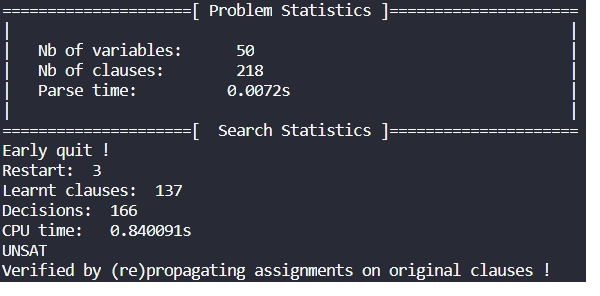

# CDCL-based SAT Solver

This repo includes my implementations for solving SAT problems as well as its variants. 
The core idea is firsly to (re)implement complete search algorithms. In particular, this code repository will mainly focus on CDCL (Conflict-driven Clause Learning) solver based on the basic DPLL solver.

All implementations will be coded in Python. 

Let's start by:

- [x] Download / create some CNF instances (e.g. [SAT Lib benchmarks](https://www.cs.ubc.ca/~hoos/SATLIB/benchm.html))
- [x] Read and load input data => dimacs_parser.py
- [x] Specify parameters such as input instances => utils.py
- [x] Launch SAT solver on terminal => main.py
- [x] Verbose option : if verbose mode is on, let's plot "problem statistics" and "search statistics" (inspired by minisat, but still need to add & update printed information)
- [x] Create a basic complete SAT solver e.g. original dpll_solver.py
- [X] Implement CDCL solver => cdcl_solver.py

More precisely, some necessary functions of CDCL solver are the followings:
 
- [X] Conflict analysis
- [X] Backtracking
- [X] Search => by BCP and Unit Propagate (UP)
- [X] Stopping criterion
- [X] Two-watched literals
- [X] Simple restart
- [X] Simple branching heuristics 

## How to launch? 

Simply put, just install some SAT benchmarking instances and declare its path when lauching main.py. Let's wait for the response ! 
Something like this will appear : 

## Analytics

Solver now can answer correctly some simple instances. But with harder instances, the computational complexity seems to be a hard challenge => try to solve this issue by update new mechanisms and simplify the code 

## TODO

- [ ] Simplify code if possible => Honestly, there exists many parts of codes in which, maybe, I complicated matters :(  
- [ ] Add complex mechanism of restart and branching heuristics => Seems challenging but, certainly possible ! 

More precisely, following implementations can be considered:

- Clause deletion & clause usefulness heuristics => how and when to add/remove/update learnt clauses?

    - [ ] Clause activity
    - [ ] Literal Block Distance (LBD)
    - [ ] Clause size

- Variable heuristics => how to choose 'best' unassigned variable to branch?

    - [ ] VSIDS
    - [ ] Dynamic Largest Individual Sum 
    - [ ] Learning rate based heuristic

- Restart mechanism => avoid concentrating too much on useless search space

    - [x] Fixed restart
    - [ ] Geometric restart
    - [ ] Luby restart
    - [ ] Glucose restart

- Preprocessing and inprocessing 

## Further improvement => Hybrid solution !! 

## References

- MiniSat open source [[Git](https://github.com/niklasso/minisat)]
- PySat open source [[Git](https://github.com/pysathq/pysat)] [[Doc](https://pysathq.github.io/#)]

 

